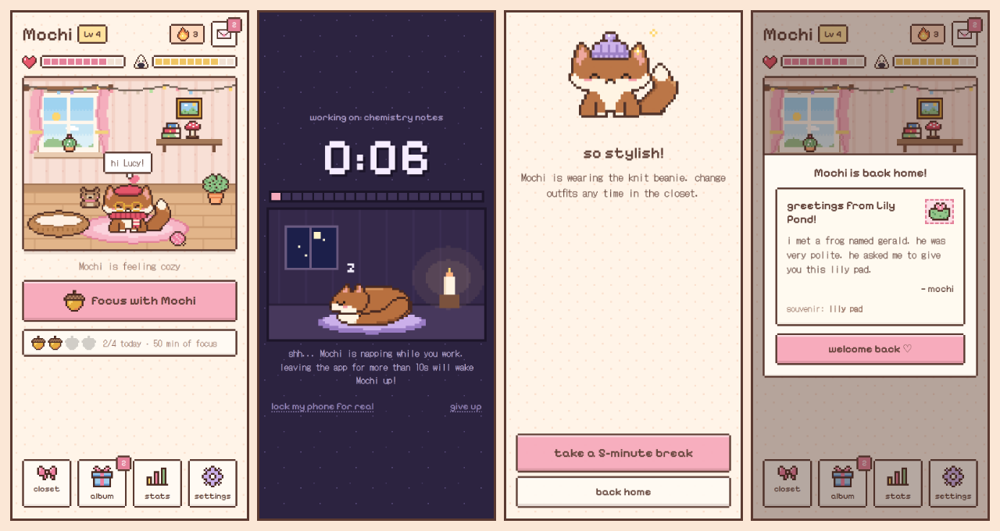
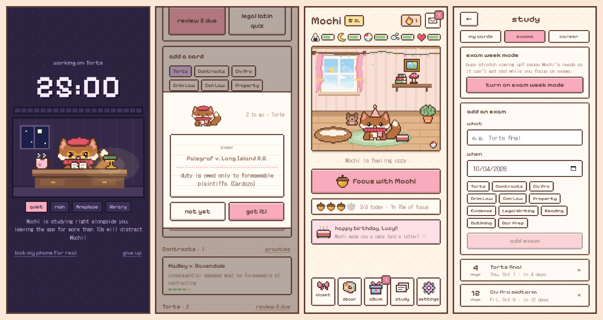

# TamaLucy 🦊

A cozy, pixel-art Tamagotchi (with a little Sims in it) that helps you focus.
A brown fox lives in a tiny room on your phone, walks around, eats, naps and
plays on its own, and wants your attention. Study with it (Pomodoro-style) and
it earns adventures, gifts, treats, clothes and handwritten notes, and climbs a
law career from 1L to the Supreme Court. Stay away too long and it gets hungry,
lonely, and eventually really down.




It's an installable web app (PWA), so it runs on **iPhone and Android** from the
home screen, works offline, and needs no app store.

## What's inside

**Focus timer**
- Pick 10 / 15 / 25 / 45 / 60 minutes (or any length in 5-minute steps), plus an optional "what are you working on?".
- During focus the fox naps in a dim night-light scene, and the screen is kept awake.
- **Leaving the app wakes the fox.** Switch apps for more than the grace period (10s by default) and the session fails and the fox gets sad. A quick accidental swipe is forgiven. There's also a "just pause" mode in settings.
- Built-in guide for locking the phone to the app for real (iPhone Guided Access, Android App Pinning). See [below](#about-you-cant-touch-other-apps).
- **On her Mac** the timer keeps going while she studies in other apps, and a notification calls her back when it's done. See [Focus on a Mac](#focus-on-a-mac).
- **One fox on her iPhone and her Mac**: she signs in with her code and it's the same fox, with the same everything. See [One fox, every device](#one-fox-every-device).
- Optional break timer afterwards.

**Rewards after every session** (pick one; 15+ min gives 3 options to choose from, 45+ min gives two rewards):
- 🎒 **Adventure**: the fox leaves for a few minutes (the length of your break) and comes back with a postcard + souvenir from one of 8 places.
- 🎁 **Gift**: 11 pieces of decor that show up in the room (fairy lights, mushroom lamp that glows at night, teddy bear, heart rug...).
- 🍓 **Treat**: 8 snacks that fill the tummy. The fox secretly has two favourites to discover.
- 🎀 **Clothes**: 11 outfits (frog hat, strawberry hat, beret, flower crown, heart shades, scarf...). Mix and match in the closet.
- 💌 **Note**: the fox writes you a little letter. ~40 notes, some depending on time of day, session length and your streak.

**Acorns: studying is how she looks after the fox**
- Focusing earns acorns: 1 for every 5 minutes (a 25-minute session = 5), shown
  in the top bar and on the reward screen.
- Looking after the fox costs them: a portion of food 1 (so refilling an empty bowl
  is 3), a bath 2, and brushing, cuddles, chats, dancing, tag, ball or yarn 1 each.
  The pie menus show the price, and if she's short, the fox suggests focusing together.
- Always free: petting, naps, treats she's already won, flashcards and quizzes. The
  fox still eats from its bowl, naps and plays with its toys on its own, but only
  studying refills the bowl and keeps it clean. Prices live in `COSTS` in
  `src/game/logic.ts`.

**A little life sim (Sims-style)**
- **Needs:** hunger, energy, fun, hygiene and social, shown as five bars. Mood comes from all of them, and one very low need drags it down.
- **Free will:** the fox walks around the room by itself. It eats from its bowl when hungry, naps when tired, plays with the ball or yarn, reads your casebooks at the desk, looks out the window, and hugs its teddy when lonely. Thought bubbles show what it wants.
- **Pie menus:** tap the fox for pet, cuddle, chat, brush fur, dance, play tag, give a treat or quiz me. Tap furniture to use it: refill the bowl, bath time, take a nap, study together at the desk, and so on. The current action shows as a chip you can cancel, and nothing is charged unless it finishes.
- **A bigger room:** swipe to pan across it. There's a living room, a study corner with a green banker's lamp, a clawfoot bathtub, a food bowl and a wall clock that shows the real time.
- **Decor:** wallpapers and floors to choose from, with more unlocked by the career.
- **While you're away** the fox looks after itself (a full bowl buys it about a day), but it still gets sad after about 2 days and depressed around day 3. The room turns grey, the fox curls up under a rain cloud, and it leaves "while you were away..." letters.
- The window follows the real time of day, and the fox sleeps in its basket at night.

**Law school edition**
- **Career ladder:** every hour of focus moves the fox up: Pre-Law Pup, 1L, 2L, 3L, Law Graduate, Passed the Bar, Associate, Senior Associate, Partner, Judge, Supreme Court Justice. Each promotion gets a celebration and unlocks something (grad cap, tie, judge wig, diploma, gavel, scales of justice, wallpapers).
- **Subjects:** one-tap chips on the focus screen (Torts, Contracts, Civ Pro, Crim Law, Con Law, Property, Evidence, Legal Writing...), with study time per subject on the career screen. Edit the list in `src/gift.ts`.
- **Legal Latin flashcards:** the fox quizzes you on 26 terms (mens rea, stare decisis, res ipsa loquitur...). Tap the fox → *quiz me*, the desk → *flashcards*, or use it during breaks.
- **Her own flashcards:** cards for her classes (cases, rules, elements), sorted by subject and reviewed as flip cards. Spaced repetition brings each card back right before she'd forget it: a card she knows comes back in 1, 3, 7, then 21 days, and a missed one comes back right away.
- **Exam countdowns:** add exams with a date. Home counts down the last week, and on the morning of an exam the fox leaves a good-luck note.
- **Studying together:** during focus the fox sits at its little desk in study glasses with a casebook, cocoa and a banker's lamp. Optional background sound (rain, fireplace or library hum) is generated in the app, with no audio files.
- Law-pun notes from the fox ("IRAC. issue: you're tired..."), a Law Library and Courthouse Steps adventure.

**Kind to a busy student**
- **Care level** in settings: *classic* (can get depressed), *gentle* (needs drain more slowly and it never gets more than a little sad), or *exam week* (everything pauses, with a one-tap switch on the exams tab).
- **Backup & restore:** a backup code (about 1 KB) she can copy into Notes or save as a file, then paste back on a new phone.

**Little surprises**
- **Birthday:** set in `gift.ts` or settings. On the day the fox wears a party hat, there's a cake and confetti, and a birthday letter arrives (yours, if you write one in `gift.ts`). She keeps the party hat afterwards.
- **Seasons:** snow outside the window in winter, blossom petals in spring, fireflies on summer nights, falling leaves in autumn, and a jack-o'-lantern on the sill in October. The pumpkin hat can only be won in October and the earmuffs only in winter.
- **A photo on the wall:** she picks any photo in *decor* and it becomes pixel art in a frame in the study corner. It stays on the phone.
- Streaks, a daily "4 acorns" goal and a weekly chart.

**Letters from far away ✉**
- You can keep writing to her after the gift is given. Letters you send from the
  *post office* page arrive at the fox's door: "you've got mail!", an envelope to
  open, and the letter kept in her album. Schedule them for a date (her exam
  morning, her birthday, a random Tuesday) and they stay hidden until then.
  See [Letters from far away](#letters-from-far-away-).

**Look & feel**: everything is hand-made pixel art drawn in code (no image files), in a
warm pink/cream kawaii palette, with *Pixelify Sans* + *DotGothic16* pixel fonts and small
chiptune sound effects.

## Make it personal 💌

Edit [`src/gift.ts`](src/gift.ts):

```ts
export const GIFT = {
  appName: 'TamaLucy',        // home-screen name
  recipientName: 'Lucy',      // pre-filled "your name"
  foxName: 'Mochi',           // suggested fox name (they can rename it)
  from: '',                   // your name, signs the secret letters
  welcome: '',                // optional message on the very first screen
  secretNotes: [],            // your own letters, see below
  birthday: '',               // 'MM-DD' for the birthday surprise
  birthdayLetter: '',         // your letter for her birthday (optional)
  subjects: [...],            // subject chips on the focus screen
}
```

**Secret letters**: anything you put in `secretNotes` is delivered by the fox in
order, "found tucked under the rug". One is guaranteed after the 1st, 3rd, 7th,
12th, 20th, 30th... completed focus session, and they can also turn up when the
fox writes a note. This is the best place to hide something sweet.

> **Is this repository public?** Then anything in `gift.ts` is public too. Put the
> personal parts in **`src/gift.local.ts`** instead. It's git-ignored, so it's never
> pushed, but it's still built into the app:
>
> ```ts
> // src/gift.local.ts (only the fields you want to override)
> export const GIFT = {
>   from: 'Sam',
>   secretNotes: ['hi! if you are reading this, ...'],
>   birthday: '03-14',
> }
> ```
>
> Build it on your own computer (`npm run build`) and upload `dist/`. A build
> made by GitHub Actions or Netlify from the repository won't see the file.

## Run it

```bash
npm install
npm run dev        # http://localhost:5173
npm test           # game-logic unit tests
npm run build      # production build in dist/
```

**Try the whole loop in a minute:** open the app with `?debug` (or `#debug`) on the end of the
URL. That adds a 6-second focus length and a 12-second break/adventure length
(Settings → break length), so you can see every reward without waiting.

## Put it on her iPhone and her Mac

1. **Host `dist/`** anywhere static. Paths are relative, so any folder works:
   - **GitHub Pages**: repo Settings → Pages → Source "GitHub Actions", then run the
     *Deploy to GitHub Pages* workflow from the Actions tab. (Pages on a private repo needs a paid GitHub plan.)
   - **Netlify / Vercel / Cloudflare Pages**: build command `npm run build`, output folder `dist`.
2. **Install it on both:**
   - **iPhone** (Safari): Share → *Add to Home Screen*. It opens full-screen, works
     offline, and its data isn't subject to Safari's 7-day storage cleanup.
   - **Mac** (Safari, macOS Sonoma or later): File → *Add to Dock…*. It gets its own
     window and Dock icon. (In Chrome: the install icon in the address bar.)
3. **Sign in on both with her mailbox code** (see below). It's the same fox everywhere.

**Real iPhone and Mac apps.** [`ios/`](ios/README.md) wraps the same app as native apps,
built with Xcode and your Apple Developer account:
- **iPhone:** the fox in her Dynamic Island, and her distracting apps locked while she
  focuses (Screen Time).
- **Mac:** the fox and a countdown in the menu bar, and a fox that pops up over her
  distracting apps during focus. You send it to her as a normal Mac app.

Either way it's the same fox everywhere, website or app.

### One fox, every device

Her mailbox code is her login. The fox lives in the cloud (the same small Supabase
database as the letters), so signing in on a device is like logging into an account:
her fox, its needs, acorns, clothes, letters, flashcards, exams and stats are the same
on her iPhone and her Mac.

- **Signing in:** on a brand-new install, tap *"i already have my fox on another
  device"* on the first screen and type the code, or use *Settings → mailbox & sync*.
  The link `https://<your-site>/#mail=<code>` signs in too. Signing in on a device
  that already had a fox replaces it with hers.
- **Staying in step:** each device saves a few seconds after she does something, and
  looks for the other device's progress when it opens, when it comes back to the front,
  and once a minute while it's open. Time spent on one device never counts as "time
  away" on the other.
- **Using both at once:** if both devices changed things before they caught up, the
  changes are merged: earnings add up, collections are combined, and a setting changed
  on one side wins. Nothing she earned is lost. (Every save is a compare-and-swap, so a
  device can't overwrite a newer save without merging it first.)
- **What stays per device:** a focus session runs on the device she started it on, and
  the leave rule is set per device (see below). Offline, everything keeps working and
  catches up when she's back online.
- **Without a code** the fox just lives on that device. Settings → *backup* still makes
  a code to move it by hand.

### Focus on a Mac

A Mac is where she reads and writes, so leaving the app can't be the thing that ends a
session there. On a Mac the default is **keep going**: the timer runs while she works
in Word, Preview or a browser, the window title counts down, and when time's up she
gets a notification and a chime (she's asked for notification permission the first
time she starts a session). The iPhone keeps the strict rule. Either device can
change it in *Settings → when I leave the app during focus*.

## Letters from far away ✉

Letters are kept in a tiny [Supabase](https://supabase.com) database (free plan).
There are two secret codes, made with `node scripts/new-mailbox.ts`:

| | who has it | what it does |
|---|---|---|
| **mailbox code** (`five-cute-words-and-123`) | her | reads letters that have arrived |
| **writer key** (`writer-xxxx-xxxx-…`) | you | writes, schedules and takes back letters |

**Give her the mailbox code** (it's also her login, see above) in one of two ways:
- Send her the link `https://<your-site>/#mail=<mailbox-code>`. Opening it signs her in, and the code disappears from the address bar.
- Or write the code on the gift card. She types it on the first screen (*"i already
  have my fox on another device"*) or in *Settings → mailbox & sync*.
  On iPhone, the home-screen app has its own storage, separate from Safari, so
  if she opened the link in Safari first she'll need to type the code in the
  installed app once.

**Write to her** at `https://<your-site>/#write`. Enter the writer key once (it's
remembered on that device only), write, preview, then send it right away or
pick a day and time. You can see which letters are waiting and which were sent, and
take back one that hasn't arrived yet. The app checks for mail when she opens it
and every 15 minutes while it's open, but never during a focus session.

**Privacy.** The database stores only sha256 hashes of the two codes, never the
codes themselves. Its tables are closed to the public API; everything goes through
small database functions that each check a code first
([`supabase/migrations/`](supabase/migrations/)). The publishable key in
`src/game/remote.ts` is public by design and can't open anything by itself.
Anyone who has her mailbox code can read her letters and sign in as her fox, and
anyone who has the writer key can write to her (but can't see her fox), so keep both
out of the repository and share them only with her.

**Good to know**
- Free Supabase projects pause after about a week with no requests. Her app keeps
  it awake whenever she opens it. If it does fall asleep, Supabase emails you, and
  one click on *Restore* in the dashboard wakes it up with every letter still there.
- Letters are up to 2,000 characters. Scheduled times use the writer's time zone.
- Letters can't be fetched from the Claude artifact preview (it blocks network
  requests). They work on the real site.
- **Using your own Supabase project instead:** run the SQL files in
  `supabase/migrations/` in order (SQL editor), put your project URL and publishable key in
  `src/game/remote.ts`, then run `node scripts/new-mailbox.ts` and paste the one
  line of SQL it prints.

## About "you can't touch other apps"

Web apps aren't allowed to block other apps, so TamaLucy does what focus apps
like Forest do: it **detects when you leave** (the page goes to the background)
and makes it cost something. The fox wakes up worried and the session doesn't
count. It also catches the app being killed or reloaded mid-session, and
keeps the screen awake so the phone doesn't auto-lock and trip the timer.

For a real lock, both phones have one built in, and the app explains how in
*Focus → "lock my phone for real"*:
- **iPhone: Guided Access** (Settings → Accessibility → Guided Access, then triple-click the side button in the app).
- **Android: App pinning** (Settings → Security → App pinning).

True OS-level app blocking needs a native app: Apple's Screen Time API
(FamilyControls) with an Apple-approved entitlement, or Android's usage-access
and accessibility APIs. Wrapping this project with Capacitor is the most direct
route there if you ever want it.

## Project layout

```
src/
  gift.ts            ← personalise here
  art/               pixel art as code: fox, clothes, items, room (+ day/night)
  game/              state + save migration, needs & offline simulation, sessions,
                     rewards, law career, flashcards, text content, tests
  ui/                canvas renderer, the room (camera, pie menus), the fox's
                     free-will brain (brain.ts), shared widgets
  screens/           onboarding, home, focus, rewards, break, closet, album, stats, settings
  write/             the post office (#write): writing and scheduling letters
  mail.ts            checks her mailbox and announces new letters
  sync.ts            one fox on every device: cloud save, sign-in, merging
  notify.ts          the end-of-session notification (Mac)
  native.ts          the bridge to the native iPhone and Mac apps (ios/)
scripts/
  make-icons.ts      renders the app icons from the fox sprite (npm run icons)
  sprite-sheet.ts    renders all sprites to sprites.png for quick art edits (npm run sprites)
  new-mailbox.ts     makes a mailbox code + writer key and prints the SQL to register them
supabase/migrations/ the database: letters, the cloud save, and the functions that guard them
ios/                 the native iPhone + Mac apps: Dynamic Island, Screen Time blocking, menu bar fox (see ios/README.md)
```

The sprites are text grids (one character per pixel, colours in
`src/art/palette.ts`), so tweaking the fox is a text edit. Run `npm run sprites`
to see the result.
